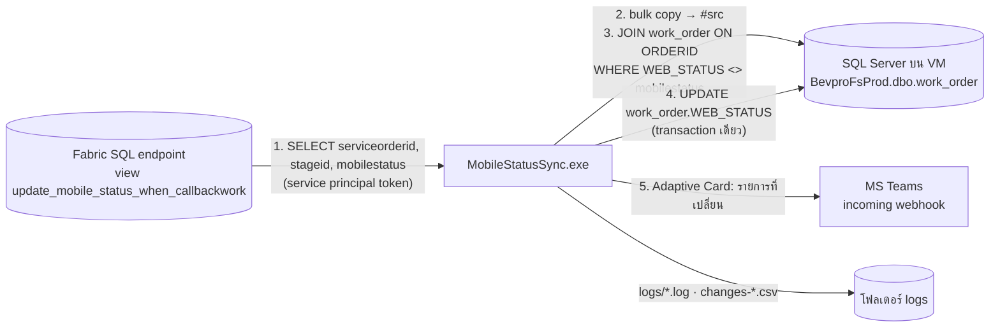

# MobileStatusSync — sync สถานะงานใน mobile app ตาม stage ของ D365 ทุก 1 ชั่วโมง

Console app (.NET 8, C#) ที่ Windows Task Scheduler บน VM `20.33.118.76` เรียกทุก 1 ชั่วโมง
งานของมัน: **เทียบ stage ของ service order ใน D365 กับสถานะที่ mobile app (Smart Field Service) เก็บอยู่ —
ถ้าต่างกันให้อัปเดต แล้วแจ้งรายการที่เปลี่ยนเข้า MS Teams**

| | |
|---|---|
| เจ้าของ | Dev (FSRProtal) |
| runbook (ติดตั้ง/ดูแล/rollback) | `docs/RB-mobile-status-sync.md` |
| สถานะ 2026-09-04 | build + dry-run ผ่านจากเครื่อง dev (อ่าน Fabric จริง, เทียบ `BevproFsProd` จริง) — **ยังไม่ได้ติดตั้งบน VM** |



## แหล่งข้อมูลที่พบจริง (2026-09-04)

| สิ่งที่ | อยู่ที่ | หมายเหตุ |
|---|---|---|
| ต้นทาง: stage ของ D365 | view `dbo.update_mobile_status_when_callbackwork` บน Fabric SQL analytics endpoint (Dataverse mirror — server/database เดียวกับ `config.sql` ใน `onelake-middleware/src/config/index.js`) | คืน `serviceorderid, stageid, mobilestatus` โดย INIT→`0`, INPR→`2`, POST/FINS→`4` · ~353,000 แถว อ่านได้ใน ~4 วินาที |
| ปลายทาง: สถานะใน app | `BevproFsProd.dbo.work_order` บน VM `20.33.118.76` (DB เดียวกับ `PROD_DB_*` ของ backend) · key = `ORDERID` | ตารางยัง live (แก้ ~6,600 แถว/สัปดาห์) |
| คอลัมน์ที่ sync | `work_order.WEB_STATUS` (int, ค่า 0/1/2/3/4) | **ดูหัวข้อถัดไป — ต้องยืนยันกับเจ้าของระบบ** |
| Teams | incoming webhook ตัวเดียวกับ `TEAMS_WEBHOOK_URL` ของ backend (payload แบบเดียวกับ `teamsNotificationService.js`) | |

### ทำไมค่า default เป็น `WEB_STATUS` ไม่ใช่ `ZZMOBILE_STATUS` (ข้อสันนิษฐานที่ต้องยืนยัน)

โจทย์พูดถึง `ZZMOBILE_STATUS` แต่จากข้อมูลจริง:

| คอลัมน์ใน `work_order` | ค่าที่เก็บจริง | เทียบกับ view ได้ไหม |
|---|---|---|
| `ZZMOBILE_STATUS` (nvarchar 40) | `COMP`, `RFRP`, `EQNM`, `USYR`, `USIS`, … (รหัส "ผลปิดงาน") = ชุดเดียวกับ `bpc_mobilestatus` ใน D365 | **ไม่ได้** — view ให้ `0/2/4` ถ้าเขียนทับจะทำลายรหัส COMP/RFRP |
| `WEB_STATUS` (int) | `0, 1, 2, 3, 4` | **ได้** — ตรงกับ view; เคสที่ view ตั้งใจจับคือ D365 เปิดงานกลับเป็น INIT/INPR แต่ app ยังค้าง `4` |

จึงตั้ง default = `WEB_STATUS`; ถ้าเจ้าของระบบยืนยันว่าต้องการคอลัมน์อื่น เปลี่ยนที่ `Target:StatusColumn` ได้โดยไม่ต้องแก้โค้ด

⚠️ ผล dry-run รอบแรก (831 รายการต่างกัน) มี transition `1→0` (212) และ `3→2` (208) — สถานะ `1`/`3` เป็นขั้นกลางที่ app เดินเอง (view ไม่มีค่านี้)
การเขียนทับจะ**ถอยงานที่ช่างกำลังทำ** → ใช้ `Sync:AllowedTransitions` จำกัดให้เหลือเฉพาะเคสที่ต้องการ เช่น `["4>0", "4>2", "*>4"]` (D365 เรียกงานกลับ / D365 ปิดงานแล้ว)

## Config (appsettings.json → appsettings.Production.json → env `MSS_*` → command line)

ค่าจริงของ secret ใส่ใน `appsettings.Production.json` บน VM เท่านั้น (gitignore แล้ว) หรือ env var เช่น `MSS_Fabric__ClientSecret`

| key | ค่า default | ความหมาย |
|---|---|---|
| `Fabric:Server` / `Fabric:Database` | Fabric SQL endpoint ของ Dataverse mirror | ไม่ใช่ secret (อยู่ใน `config.sql` ของ backend อยู่แล้ว) |
| `Fabric:TenantId` / `ClientId` / `ClientSecret` | *(ว่าง — ต้องใส่)* | service principal ตัวเดียวกับ `AZURE_TENANT_ID` / `AZURE_CLIENT_ID` / `AZURE_CLIENT_SECRET` ของ backend |
| `Fabric:SourceQuery` | `SELECT serviceorderid, stageid, mobilestatus FROM dbo.update_mobile_status_when_callbackwork` | เปลี่ยน view ได้ แต่ต้องคืน 3 คอลัมน์ชื่อนี้ |
| `Fabric:Encrypt` | `Mandatory` | สลับเป็น `Strict` (TDS 8.0) ได้ถ้าจำเป็น |
| `Target:ConnectionString` | `Server=localhost,1433;Database=BevproFsProd;User ID=;Password=;…` | บน VM ต่อ localhost ได้เลย |
| `Target:Table` / `KeyColumn` / `StatusColumn` | `dbo.work_order` / `ORDERID` / `WEB_STATUS` | ชื่อทุกตัวถูก validate ด้วย regex ก่อนประกอบ SQL |
| `Target:TouchColumn` | *(ว่าง)* | ถ้าใส่ชื่อคอลัมน์ datetime จะ stamp `SYSDATETIME()` ทุกแถวที่อัปเดต |
| `Sync:DryRun` | **`true`** | เทียบ + รายงาน + audit CSV แต่ไม่ UPDATE — ต้องตั้ง `false` (หรือ `--apply`) เองเมื่อพร้อม |
| `Sync:MaxChangesPerRun` | `500` | circuit breaker: ถ้าต่างกันมากกว่านี้ **ไม่อัปเดต** ส่ง Teams เตือนแทน (กัน view พัง/แมปผิดแล้วกวาดทั้งตาราง) · `0` = ไม่จำกัด |
| `Sync:AllowedTransitions` | `[]` = เขียนทุกความต่าง | whitelist `old>new` (`*` = อะไรก็ได้, `NULL` = ปลายทางว่าง) — แนะนำ `["4>0","4>2","*>4"]` |
| `Teams:WebhookUrl` | *(ว่าง — ต้องใส่)* | ค่าเดียวกับ `TEAMS_WEBHOOK_URL` |
| `Teams:MaxListedRows` | `20` | จำนวนแถวที่โชว์ในการ์ด (ทั้งหมดอยู่ใน `changes-*.csv`) |
| `Teams:NotifyWhenNoChanges` | `false` | `true` = ส่งการ์ดทุกรอบแม้ไม่มีอะไรเปลี่ยน (ทุก 1 ชั่วโมง — ไม่แนะนำ) |
| `LogDirectory` | `logs` (relative กับโฟลเดอร์ exe) | |

command line ทางลัด: `--dry-run` · `--apply` · `--no-teams` · key ใดก็ได้แบบ `--Sync:MaxChangesPerRun=20000`

## Build / run / publish (บนเครื่อง dev)

```bash
dotnet build MobileStatusSync -c Release

# ทดสอบจากเครื่อง dev (ใช้ค่าจาก .env ของ backend ผ่าน env var, ไม่ส่ง Teams)
MSS_Fabric__TenantId=... MSS_Fabric__ClientId=... MSS_Fabric__ClientSecret=... \
MSS_Target__ConnectionString="Server=20.33.118.76,1433;Database=BevproFsProd;User ID=...;Password=...;Encrypt=False;TrustServerCertificate=True" \
dotnet MobileStatusSync/bin/Release/net8.0/MobileStatusSync.dll --dry-run --no-teams

# แพ็กสำหรับ VM — self-contained (ไม่ต้องติดตั้ง .NET บน VM, ~80 MB)
dotnet publish MobileStatusSync -c Release -r win-x64 --self-contained true -o MobileStatusSync/publish
# หรือ framework-dependent (~2 MB, VM ต้องมี .NET Runtime 8 ขึ้นไป — RollForward=Major รองรับ 9/10)
dotnet publish MobileStatusSync -c Release -r win-x64 --self-contained false -o MobileStatusSync/publish
```

ผลลัพธ์คือ `MobileStatusSync.exe` + `MobileStatusSync.dll` (+ dependency) ใน `publish/` — Task Scheduler เรียก `.exe` (ซึ่งโหลด `.dll`)

## ติดตั้งบน VM (สรุป — รายละเอียดใน runbook)

1. copy `publish/` ทั้งโฟลเดอร์ไป `C:\Services\MobileStatusSync\`
2. สร้าง `appsettings.Production.json` ใส่ `Fabric:TenantId/ClientId/ClientSecret`, `Target:ConnectionString`, `Teams:WebhookUrl`
3. รันมือ 1 ครั้ง: `MobileStatusSync.exe --dry-run` → ดูการ์ดใน Teams + `logs\changes-*.csv`
4. ตั้ง `Sync:AllowedTransitions` ตามที่ตกลง → ปรับ `Sync:MaxChangesPerRun` ให้พอสำหรับรอบแรก → `MobileStatusSync.exe --apply` 1 ครั้ง
5. ตั้ง `Sync:DryRun=false` ใน `appsettings.Production.json` แล้วรัน `deploy\Install-ScheduledTask.ps1` (Administrator) → task ทุก 1 ชั่วโมง

## สิ่งที่ได้ทุกรอบ

| ที่ | เนื้อหา |
|---|---|
| `logs\mobile-status-sync-yyyyMMdd.log` | ขั้นตอน 1–4 พร้อมเวลา, breakdown `old → new: count`, 20 แถวแรก |
| `logs\changes-yyyyMMdd.csv` | **ทุกแถว**ที่ต่างกัน: `timestamp,mode,key,stageid,old_value,new_value` — ที่เดียวที่เก็บค่าเดิม ใช้ rollback |
| `logs\alert-state.json` | กัน spam: การ์ด error/warning ชนิดเดียวกันส่งซ้ำไม่เกิน 1 ครั้ง/ชั่วโมง |
| Teams | การ์ด: 🔄 อัปเดตแล้ว (เขียว) · 🧪 dry-run (เหลือง) · ⛔ เกินเพดาน / ❌ error / ⚠️ view ว่าง (แดง) |
| exit code | `0` ok · `1` error/timeout 15 นาที · `2` ถูกเพดานบล็อก · `3` config ผิด (ดูใน Task Scheduler → Last Run Result) |

กันรันซ้อน 2 ชั้น: Task Scheduler `MultipleInstances=IgnoreNew` + named mutex `Global\MobileStatusSync` ในโปรแกรม

## ศัพท์ที่ใช้ในงานนี้

- **Service principal** — identity ของแอปใน Entra ID (client id + secret) ใช้ขอ token แบบ client-credentials grant (OAuth 2.0) ไปต่อ Fabric SQL endpoint
- **Set-based diff** — เทียบด้วย `JOIN` ทั้งชุดใน SQL แทนวนทีละแถว: bulk copy → temp table → `JOIN` → `UPDATE … FROM`
- **Idempotent** — รันซ้ำกี่รอบผลเท่าเดิม: รอบถัดไปไม่มีอะไรต่างก็ไม่เขียนอะไร
- **Circuit breaker** — `MaxChangesPerRun`: หยุดเองเมื่อผลผิดปกติ แทนที่จะพังเงียบ ๆ
- **Dry run** — โหมดจำลอง: ทำทุกอย่างยกเว้นขั้นที่มีผลข้างเคียง (UPDATE)
- **Audit trail** — `changes-*.csv`: หลักฐานว่าใคร/เมื่อไหร่/เปลี่ยนอะไรจากอะไรเป็นอะไร
